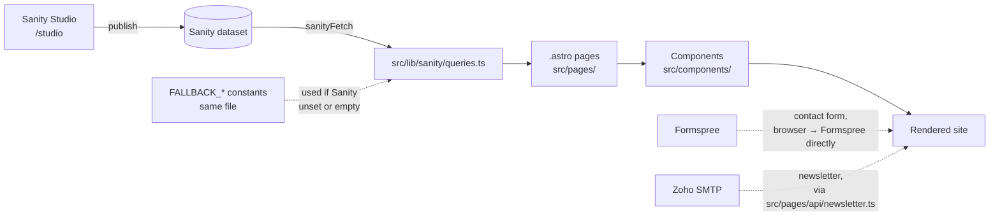

# CFIDL site — project guide

How this project fits together, and where to go when you need to change or
fix something. Written for future-you, not just a developer — each entry
under "Cookbook" names an exact file.

## The one idea that explains most of this codebase

Every piece of content on the site (headings, stats, nav links, photos) can
come from **two places**:

1. **Sanity Studio** (`/studio`) — the real content, once you've filled it
   in.
2. **A typed fallback** written directly in `src/lib/sanity/queries.ts` —
   placeholder content that's shown automatically until Studio has
   something to serve instead.

That's why the site looks fully finished the moment you clone it, before
you've connected anything. It also means there are two valid answers to
"where do I change this text" — the Studio doc, or the fallback constant —
depending on whether you've connected Sanity yet. The cookbook below gives
both.



## Project structure

```
├── schemaTypes/         Sanity schema — what content EDITORS can enter
│   ├── documents/         one file per Studio "document" (Home Page, Story…)
│   └── objects/           reusable pieces (ctaButton, stakeholder, seo…)
├── structure.ts          Sanity Studio sidebar organisation
├── sanity.config.ts      Studio config — used by the embedded /studio route
├── sanity.cli.ts         Sanity CLI config (for `npx sanity` commands)
├── astro.config.mjs      Astro build config, incl. the /studio integration
├── vercel.json           Studio deep-link rewrite for production
├── src/
│   ├── components/
│   │   ├── ui/             Button, Icon, Container, SectionHeading…
│   │   ├── layout/          Header, Footer, NewsletterForm
│   │   ├── sections/        Hero, ImpactStats, DiamondModel, CircularModel…
│   │   ├── cards/           StoryCard, PressCard, PublicationCard
│   │   └── forms/           ContactForm (Formspree)
│   ├── lib/
│   │   ├── sanity/          client.ts, image.ts, queries.ts (content + fallbacks)
│   │   └── utils.ts
│   ├── layouts/BaseLayout.astro   wraps every page: <head>, Header, Footer, page scripts
│   ├── scripts/             animations.ts (GSAP), nav.ts (mobile menu)
│   ├── styles/global.css    ALL colours, fonts, shadows — one file
│   └── pages/               one file per route, + pages/api/newsletter.ts
└── public/                 favicon, robots.txt, static files
```

## Cookbook — "I want to… / it's broken and…"

| I want to… | Edit this |
|---|---|
| Change a brand colour or font | `src/styles/global.css` — the `@theme` block. Every `bg-saffron`, `text-marigold`, `font-display` class site-wide reads from here; you don't need to touch component files. |
| Fix the mobile hamburger menu (won't open/close, wrong items) | **Start with `src/layouts/BaseLayout.astro`** — the two `<script>` tags right before `</body>`. If they've been merged back into one tag that imports both `animations` and `nav`, split them again first: a failure in the animations script can silently stop the nav script from ever attaching its click handler, which looks identical to "the button just does nothing." Confirmed *not* the cause: CSS — the `hidden … data-[open=true]:flex` toggle classes compile correctly (verified against the real Tailwind v4 CLI output). If the button still doesn't respond after the scripts are split, open the browser console and check for a red error first. Open/close *logic* → `src/scripts/nav.ts`. Markup/layout of the menu itself → `src/components/layout/Header.astro` (the `data-nav-panel` block). Menu *items* → Studio "Navigation" doc, or `FALLBACK_NAVIGATION` in `src/lib/sanity/queries.ts` if Sanity isn't connected yet. |
| The hero slideshow stutters, flashes to black, or looks laggy between photos | `src/components/sections/Hero.astro` — the `heroKeyframes` template string in the frontmatter. The fade timing is computed from `slides.length` so it stays gap-free at any photo count; if it's been hand-edited back to fixed `2% / 14% / 16%` keyframe values, that's the bug — those only look right at exactly ~6 slides. |
| Cards in the Diamond Model (or Circular Model) overlap the heading/intro text above them | `src/components/sections/DiamondModel.astro` (or `CircularModel.astro`, which I haven't personally reviewed but likely shares the same layout technique) — the `positions` array and the diamond container's `mt-*` class. Cards are absolutely positioned by percentage and centred with `-translate-y-1/2`, which doesn't know how tall a card's actual text will render — too little clearance at the top position or too little margin above the container is what causes the overlap. |
| The page background looks like the wrong colour (e.g. still shows the peach/mist wash) | As of this session, the page background is white, set in two places: `html { background-color }` in `src/styles/global.css`, and `<body class="bg-white …">` in `src/layouts/BaseLayout.astro`. Full-width sections that also painted themselves with `bg-mist` (the Diamond Model section, two spots in `Header.astro`) were switched to white too — see `PATCHES.md` item 5 for the two in `Header.astro`. Small accent uses of mist (badges, dropdown hover fills, SDG pills on the Approach page) were deliberately left alone. |
| Change what's in the header/footer nav | Studio → Navigation document (once connected), or `FALLBACK_NAVIGATION` in `src/lib/sanity/queries.ts`. |
| Change the logo | Studio → Site Settings → Logo. The SVG placeholder shown until then lives at `src/components/ui/LogoMark.astro`. |
| Change hero homepage photos | Studio → Home Page → Hero background slideshow. Placeholder set: `FALLBACK_HERO_SLIDES` in `src/lib/sanity/queries.ts`. Crossfade timing/animation → `heroKeyframes` in `src/components/sections/Hero.astro` (see slideshow row above before hand-editing this). |
| Change impact numbers (the counting stats) | Studio → Impact Stat documents (`group` = headline or secondary). Placeholders: `FALLBACK_STATS_HEADLINE` / `FALLBACK_STATS_SECONDARY` in `queries.ts`. Count-up animation logic → `src/scripts/animations.ts` (`initCounters`). |
| Add a whole new page (e.g. "Careers") | Three steps: 1) new schema in `schemaTypes/documents/`, register it in `schemaTypes/index.ts` and add it to `structure.ts` if it should appear in the Studio sidebar. 2) a query + fallback in `src/lib/sanity/queries.ts`. 3) a new `.astro` file in `src/pages/`. |
| Add a new content field to an existing page | Add the field in the matching `schemaTypes/documents/*.ts` file, add it to the GROQ projection *and* the TypeScript interface *and* the `FALLBACK_*` constant in `queries.ts`, then read it in the relevant `.astro` page/component. |
| Edit the "About" page copy/mission statement | Studio → About Page (once connected), or `FALLBACK_ABOUT_PAGE` in `queries.ts`. Rich-text body renders through `src/components/PortableText.astro`. |
| Change the Diamond Model / Circular Model sections | Content: Studio → Approach Page. Diamond layout/positions → `src/components/sections/DiamondModel.astro`. Circular steps layout → `src/components/sections/CircularModel.astro`. |
| Fix/change the contact form | Form markup + Formspree wiring → `src/components/forms/ContactForm.astro`. Where submissions go → your Formspree dashboard (`PUBLIC_FORMSPREE_FORM_ID` in `.env`). Subjects dropdown → Studio → Contact Page → Form subjects. |
| Fix/change the newsletter sign-up | Form UI → `src/components/layout/NewsletterForm.astro`. Sending logic (Zoho SMTP) → `src/pages/api/newsletter.ts`. Credentials → `.env` (`ZOHO_SMTP_*`). |
| Change SEO title/description defaults | Studio → Site Settings → Default SEO (site-wide), or per-page `seo` field. Rendering logic → `src/layouts/BaseLayout.astro`. |
| Add/change an icon | `src/components/ui/Icon.astro` — hand-drawn single-weight line icons, all in one file's `paths` object. Add a new entry, then use `<Icon name="your-new-name" />` anywhere. |
| Change scroll animations / add a new animated element | `src/scripts/animations.ts`. Tag any element with `data-animate="fade-up"` (or `fade`) and it's picked up automatically — no JS changes needed for the common case. |
| Change legal pages (Privacy, Disclaimer) | Studio → Simple Page with slug `privacy` or `disclaimer`. Until created, the visible placeholder text lives directly in `src/pages/privacy.astro` / `src/pages/disclaimer.astro`. |
| Something Sanity-related is broken across the *whole* site (header/footer look wrong on every page) | Check `src/lib/sanity/client.ts` and `.env` first — `getSiteSettings()`/`getNavigation()` run on every page via `Header.astro`/`Footer.astro`, so a connection problem shows up everywhere at once. |
| Something is broken on *one* page only | Check that page's file in `src/pages/`, and whichever `src/components/sections/*` it imports — the bug is almost always in one of those two places. |

## Typography system

Three brand roles, implemented with two font families:

- **Headings** (`h1`–`h4`, anything with the `font-display` class) →
  Roboto, weight 900 (Black). Set once in `src/styles/global.css`.
- **Subheadings** (the small uppercase "eyebrow" labels above section
  headings, e.g. "OUR APPROACH") → Roboto, weight 500 (Medium). Also set
  once, via the `.eyebrow` rule in `global.css`.
- **Body copy** (everything else — paragraphs, nav, buttons, forms) →
  Aptos, with a close fallback stack. Aptos isn't self-hosted here because
  it's a Microsoft-proprietary font not distributed on Google Fonts or
  Fontsource, and its free licence doesn't cover embedding the font file on
  a public site — see `LAUNCH_CHECKLIST.md` if you want to look into a paid
  webfont licence for guaranteed-identical rendering on every visitor's
  screen.
- IBM Plex Mono is untouched — it's used only for tabular stat figures and
  one inline `<code>` snippet, which is a functional monospace need rather
  than one of the three named brand fonts.

## Colour system

All colours are CSS custom properties in the `@theme` block of
`src/styles/global.css`; Tailwind v4 turns each `--color-x` into a full set
of utility classes (`bg-x`, `text-x`, `border-x`, `bg-x/50`, …) automatically.

| Token | Value | Used for |
|---|---|---|
| `--color-ink` / `--color-deep` | `#000000` | Headings & high-emphasis text / dark section backgrounds (hero, stats, CTA banner, footer) |
| `--color-saffron` | `#DD5E34` | Primary accent — links, buttons, eyebrow text |
| `--color-marigold` | `#D4C26B` | Secondary accent — focus rings, on-dark eyebrow text |
| `--color-mist` | `#F5D3C3` | Small accents only — badges, dropdown hover fills, SDG pills. **Not** the page background as of this session (see below). |
| `--color-cloud` | `#FFFFFF` | Page background, plus any section/card that needs plain white |
| `--color-muted` | `#323232` | Secondary/body-adjacent text |

`--color-indigo` (the Circular Model's accent colour) is repointed to
`#323232` (charcoal) rather than an off-brand blue, so the Circular Model
still reads as visually distinct from the Diamond Model (which uses
saffron) without introducing a seventh colour outside your palette.
`--color-brick` and `--color-paddy` are kept as aliases pointing at
saffron-dark/marigold respectively, purely so nothing breaks if a component
that hasn't been personally reviewed still references them.

**Page background, updated this session:** mist (`#F5D3C3`) was originally
used broadly as a page-background wash — the `<html>` background, the
`<body>` class, and several full-width sections. Flagged as "visually
unpleasing" at that scale, so it's been replaced with white (`--color-cloud`)
everywhere it was painting a large area: `html`/`body` in
`global.css`/`BaseLayout.astro`, the Diamond Model section, and two spots in
`Header.astro` (the scrolled-state header tint and the mobile nav panel —
see `PATCHES.md` item 5). Mist itself is still defined and still used for
small accents, since it's one of your six named brand colours — it just no
longer dominates the page. If you want it removed even from those small
accent spots, or want it back as the page background, search the codebase
for `bg-mist` to find every remaining use.

If anything on the site still shows an old (pre-rebrand) colour — an
orange/gold/brown that isn't `#DD5E34` or `#D4C26B` — that component has a
hardcoded value rather than a token. Search the codebase for the old hex
codes (`c1531a`, `f2a53c`, `2c4a63`, `6e5a45`) to find it.
