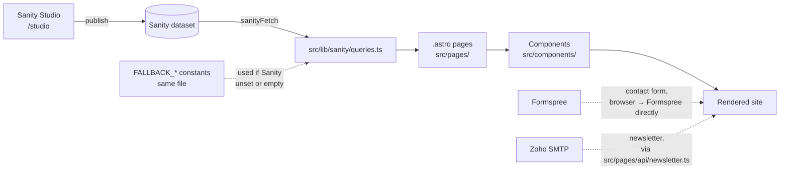

# CFIDL site — project guide

How this project fits together, and where to go when you need to change or
fix something. Written for future-you, not just a developer — each entry
under "Cookbook" names an exact file. Pair this with
`LAUNCH_CHECKLIST.md`, which is the _sequence_ of things left to do; this
file is the _map_ you use once you're in the middle of doing them.

## The one idea that explains most of this codebase

Every piece of content on the site (headings, stats, nav links, photos) can
come from **two places**:

1. **Sanity Studio** (`/studio`) — the real content, once you've filled it
   in.
2. **A typed fallback** written directly in `src/lib/sanity/queries.ts` —
   placeholder content that's shown automatically until Studio has
   something to serve instead.

That's why the site looks fully finished the moment you clone it, before
you've connected anything. It also means there are two valid answers to
"where do I change this text" — the Studio doc, or the fallback constant —
depending on whether you've connected Sanity yet. The cookbook below gives
both.



## How a page actually gets built, step by step

Worth understanding once, since it explains almost every "where do I edit
this" question below. Take `src/pages/impact.astro` as an example:

1. **The file in `src/pages/` is the route.** `impact.astro` exists at
   that exact path, so it _is_ `/impact` — Astro doesn't need a router
   config, the file path is the route.
2. **Its frontmatter (the `---` fenced block at the top) fetches data**,
   by calling functions from `src/lib/sanity/queries.ts` — e.g.
   `getStats('headline')`. Those functions try Sanity first, and fall back
   to the `FALLBACK_*` constant in that same file if Sanity isn't
   connected or the query comes back empty.
3. **The rest of the file is markup that uses that data**, largely by
   handing it to components from `src/components/` — `<ImpactStats
headlineStats={headlineStats} .../>`.
4. **Those components** (`src/components/sections/ImpactStats.astro`) are
   where the actual HTML structure and Tailwind classes live. This is
   almost always the file you want if something needs to _look_ different.
5. **Every page is wrapped in `src/layouts/BaseLayout.astro`**, which is
   where the `<head>`, the `<Header>`, the `<Footer>`, fonts, and the two
   global `<script>` tags (animations, nav) live. If something is wrong on
   _every_ page, this file (or something it imports) is usually why.

## Project structure

```
├── schemaTypes/         Sanity schema — what content EDITORS can enter
│   ├── documents/         one file per Studio "document" (Home Page, Story…)
│   └── objects/           reusable pieces (ctaButton, stakeholder, seo…)
├── structure.ts          Sanity Studio sidebar organisation
├── sanity.config.ts      Studio config — used by the embedded /studio route
├── sanity.cli.ts         Sanity CLI config (for `npx sanity` commands)
├── astro.config.mjs      Astro build config, incl. the /studio integration
├── vercel.json           Studio deep-link rewrite for production
├── src/
│   ├── components/
│   │   ├── ui/             Button, Icon, Container, SectionHeading…
│   │   ├── layout/          Header, Footer, NewsletterForm
│   │   ├── sections/        Hero, ImpactStats, DiamondModel, CircularModel…
│   │   ├── cards/           StoryCard, PressCard, PublicationCard
│   │   └── forms/           ContactForm (Formspree)
│   ├── lib/
│   │   ├── sanity/          client.ts, image.ts, queries.ts (content + fallbacks)
│   │   └── utils.ts
│   ├── layouts/BaseLayout.astro   wraps every page: <head>, Header, Footer, page scripts
│   ├── scripts/             animations.ts (GSAP), nav.ts (mobile menu)
│   ├── styles/global.css    ALL colours, fonts, shadows — one file
│   └── pages/               one file per route, + pages/api/newsletter.ts
└── public/                 favicon, robots.txt, static files
```

## Cookbook — "I want to… / it's broken and…"

| I want to…                                                                                                           | Edit this                                                                                                                                                                                                                                                                                                                                                                                                                                                                                                                                                                                                                                                                                                                                                                                                                                                                                                                                                                                                                                                                                                                                                                                                                                                                                                                                                                                                                                                                                                                                                                                                                                                                                                                                                   |
| -------------------------------------------------------------------------------------------------------------------- | ----------------------------------------------------------------------------------------------------------------------------------------------------------------------------------------------------------------------------------------------------------------------------------------------------------------------------------------------------------------------------------------------------------------------------------------------------------------------------------------------------------------------------------------------------------------------------------------------------------------------------------------------------------------------------------------------------------------------------------------------------------------------------------------------------------------------------------------------------------------------------------------------------------------------------------------------------------------------------------------------------------------------------------------------------------------------------------------------------------------------------------------------------------------------------------------------------------------------------------------------------------------------------------------------------------------------------------------------------------------------------------------------------------------------------------------------------------------------------------------------------------------------------------------------------------------------------------------------------------------------------------------------------------------------------------------------------------------------------------------------------------- |
| Change a brand colour or font                                                                                        | `src/styles/global.css` — the `@theme` block. Every `bg-saffron`, `text-marigold`, `font-display` class site-wide reads from here; you don't need to touch component files. **One exception:** `public/favicon.svg` is a plain, standalone SVG file loaded directly by the browser tab — it can't reference CSS custom properties, so its colours are hardcoded hex values that have to be updated by hand if the palette ever changes. It was out of sync with the rest of the brand until Round 3 fixed it; see `SESSION_LOG.md`.                                                                                                                                                                                                                                                                                                                                                                                                                                                                                                                                                                                                                                                                                                                                                                                                                                                                                                                                                                                                                                                                                                                                                                                                                         |
| **Fix the mobile hamburger menu** (won't open, opens invisibly and blocks the rest of the page, or just feels janky) | **The confirmed cause (Round 3):** `backdrop-blur-*` (Tailwind's version of `backdrop-filter`) turns whatever element it's on into the _containing block_ for any `position: fixed` element inside it — same as `transform`, `filter` or `perspective` would. The header used to put its scrolled-state `backdrop-blur-lg` directly on `<header>`, which is also the parent of the `position:fixed` mobile nav panel. Before scrolling there's no blur, so the panel sizes itself against the real viewport and works fine; the moment you scroll and the header blurs, the panel starts sizing itself against the 76px header bar instead, collapsing to no visible area while still capturing every click. **The fix:** the blur now lives on an inner `<div>` inside `<header>`, not on `<header>` itself, so the header stays filter-free and the panel keeps sizing against the viewport at every scroll position — see the comment block in `src/components/layout/Header.astro` right above that inner div for the full explanation. Open/close _logic_ → `src/scripts/nav.ts`. Markup/layout of the menu itself, and the hamburger↔X icon animation → `Header.astro` (the `data-nav-toggle` button and `data-nav-panel` div). Menu _items_ → Studio "Navigation" doc, or `FALLBACK_NAVIGATION` in `src/lib/sanity/queries.ts` if Sanity isn't connected yet. **If it ever breaks again:** the tell-tale sign is "works until X, breaks after X" where X is some state change (scroll, a class toggle, a route change) — that pattern usually means a _new_ filter/transform/perspective/`backdrop-filter` class got added somewhere between the fixed-position element and the viewport. Search the ancestor chain for those four properties first. |
| The hero slideshow stutters, flashes to black, or looks laggy between photos                                         | `src/components/sections/Hero.astro` — the `heroKeyframes` template string in the frontmatter. The fade timing is computed from `slides.length` so it stays gap-free at any photo count; if it's been hand-edited back to fixed `2% / 14% / 16%` keyframe values, that's the bug — those only look right at exactly ~6 slides.                                                                                                                                                                                                                                                                                                                                                                                                                                                                                                                                                                                                                                                                                                                                                                                                                                                                                                                                                                                                                                                                                                                                                                                                                                                                                                                                                                                                                              |
| Cards in the Diamond Model overlap the heading/intro text above them                                                 | `src/components/sections/DiamondModel.astro` — the `positions` array and the diamond container's `mt-*` class. Cards are absolutely positioned by percentage and centred with `-translate-y-1/2`, which doesn't know how tall a card's actual text will render — too little clearance at the top position, or too little margin above the container, is what causes the overlap. `CircularModel.astro` was checked in Round 3 and does **not** share this risk — it uses a plain CSS grid, not percentage positioning, so its four cards don't need this kind of tuning.                                                                                                                                                                                                                                                                                                                                                                                                                                                                                                                                                                                                                                                                                                                                                                                                                                                                                                                                                                                                                                                                                                                                                                                    |
| The page background looks like the wrong colour (e.g. shows the peach/mist wash instead of white)                    | The page background is white, set in two places: `html { background-color }` in `src/styles/global.css`, and `<body class="bg-white …">` in `src/layouts/BaseLayout.astro`. Full-width sections that also painted themselves with `bg-mist` (the Diamond Model section, two spots in `Header.astro`) were switched to white too. Small accent uses of mist (badges, dropdown hover fills, SDG pills on the Approach page) were deliberately left alone.                                                                                                                                                                                                                                                                                                                                                                                                                                                                                                                                                                                                                                                                                                                                                                                                                                                                                                                                                                                                                                                                                                                                                                                                                                                                                                     |
| Change what's in the header/footer nav                                                                               | Studio → Navigation document (once connected), or `FALLBACK_NAVIGATION` in `src/lib/sanity/queries.ts`.                                                                                                                                                                                                                                                                                                                                                                                                                                                                                                                                                                                                                                                                                                                                                                                                                                                                                                                                                                                                                                                                                                                                                                                                                                                                                                                                                                                                                                                                                                                                                                                                                                                     |
| Change the logo                                                                                                      | Studio → Site Settings → Logo. The SVG placeholder shown until then lives at `src/components/ui/LogoMark.astro`; the separate `public/favicon.svg` (browser tab icon) needs updating by hand if you ever change this mark, since it can't read from Studio or from CSS tokens.                                                                                                                                                                                                                                                                                                                                                                                                                                                                                                                                                                                                                                                                                                                                                                                                                                                                                                                                                                                                                                                                                                                                                                                                                                                                                                                                                                                                                                                                              |
| Change hero homepage photos                                                                                          | Studio → Home Page → Hero background slideshow. Placeholder set: `FALLBACK_HERO_SLIDES` in `src/lib/sanity/queries.ts`. Crossfade timing/animation → `heroKeyframes` in `src/components/sections/Hero.astro` (see the slideshow row above before hand-editing this).                                                                                                                                                                                                                                                                                                                                                                                                                                                                                                                                                                                                                                                                                                                                                                                                                                                                                                                                                                                                                                                                                                                                                                                                                                                                                                                                                                                                                                                                                        |
| Change impact numbers (the counting stats)                                                                           | Studio → Impact Stat documents (`group` = headline or secondary). Placeholders: `FALLBACK_STATS_HEADLINE` / `FALLBACK_STATS_SECONDARY` in `queries.ts`. Count-up animation logic → `src/scripts/animations.ts` (`initCounters`).                                                                                                                                                                                                                                                                                                                                                                                                                                                                                                                                                                                                                                                                                                                                                                                                                                                                                                                                                                                                                                                                                                                                                                                                                                                                                                                                                                                                                                                                                                                            |
| Change the icon shown on each "Get Involved" card                                                                    | Studio → Get Involved Page → each "way" now has its own **Icon** dropdown (Community / Business / Financier / Government — the same set the Diamond Model stakeholders use), added in Round 3. If Sanity isn't connected yet, edit the `icon` value on each entry in `FALLBACK_GET_INVOLVED_PAGE.ways` in `queries.ts`. Rendering → `src/pages/get-involved.astro`.                                                                                                                                                                                                                                                                                                                                                                                                                                                                                                                                                                                                                                                                                                                                                                                                                                                                                                                                                                                                                                                                                                                                                                                                                                                                                                                                                                                         |
| Add a whole new page (e.g. "Careers")                                                                                | Three steps: 1) new schema in `schemaTypes/documents/`, register it in `schemaTypes/index.ts` and add it to `structure.ts` if it should appear in the Studio sidebar. 2) a query + fallback in `src/lib/sanity/queries.ts`. 3) a new `.astro` file in `src/pages/`.                                                                                                                                                                                                                                                                                                                                                                                                                                                                                                                                                                                                                                                                                                                                                                                                                                                                                                                                                                                                                                                                                                                                                                                                                                                                                                                                                                                                                                                                                         |
| Add a new content field to an existing page                                                                          | Add the field in the matching `schemaTypes/documents/*.ts` file, add it to the GROQ projection _and_ the TypeScript interface _and_ the `FALLBACK_*` constant in `queries.ts`, then read it in the relevant `.astro` page/component. **Exception:** if you're adding a field to something that's _already_ a plain object array reference in a GROQ query (like `ways` on the Get Involved page, which is just written as `ways` with no `{...}` projection after it), GROQ returns every field on that object automatically — you only need to touch the schema, the TS interface, and the fallback, not the query string itself.                                                                                                                                                                                                                                                                                                                                                                                                                                                                                                                                                                                                                                                                                                                                                                                                                                                                                                                                                                                                                                                                                                                          |
| Add a new icon                                                                                                       | `src/components/ui/Icon.astro` — hand-drawn single-weight line icons, all in one file's `paths` object. Add a new entry to both the `IconName` type and the `paths` object, then use `<Icon name="your-new-name" />` anywhere. Two were added in Round 3 (`info`, `image`) specifically to replace the last remaining uses of a generic sparkle/star icon, which reads as an AI-generated-site visual cliché — if you're ever tempted to add a sparkle/star/magic-wand icon back in, that's worth a second thought.                                                                                                                                                                                                                                                                                                                                                                                                                                                                                                                                                                                                                                                                                                                                                                                                                                                                                                                                                                                                                                                                                                                                                                                                                                         |
| Edit the "About" page copy/mission statement                                                                         | Studio → About Page (once connected), or `FALLBACK_ABOUT_PAGE` in `queries.ts`. Rich-text body renders through `src/components/PortableText.astro`.                                                                                                                                                                                                                                                                                                                                                                                                                                                                                                                                                                                                                                                                                                                                                                                                                                                                                                                                                                                                                                                                                                                                                                                                                                                                                                                                                                                                                                                                                                                                                                                                         |
| Change the Diamond Model / Circular Model sections                                                                   | Content: Studio → Approach Page. Diamond layout/positions → `src/components/sections/DiamondModel.astro`. Circular steps layout → `src/components/sections/CircularModel.astro`.                                                                                                                                                                                                                                                                                                                                                                                                                                                                                                                                                                                                                                                                                                                                                                                                                                                                                                                                                                                                                                                                                                                                                                                                                                                                                                                                                                                                                                                                                                                                                                            |
| Fix/change the contact form                                                                                          | Form markup + Formspree wiring → `src/components/forms/ContactForm.astro`. Where submissions go → your Formspree dashboard (`PUBLIC_FORMSPREE_FORM_ID` in `.env`). Subjects dropdown → Studio → Contact Page → Form subjects.                                                                                                                                                                                                                                                                                                                                                                                                                                                                                                                                                                                                                                                                                                                                                                                                                                                                                                                                                                                                                                                                                                                                                                                                                                                                                                                                                                                                                                                                                                                               |
| Fix/change the newsletter sign-up                                                                                    | Form UI → `src/components/layout/NewsletterForm.astro`. Sending logic (Zoho SMTP) → `src/pages/api/newsletter.ts`. Credentials → `.env` (`ZOHO_SMTP_*`), now also declared with types in `src/env.d.ts` so a typo gets caught by `npm run typecheck` instead of silently failing at send time.                                                                                                                                                                                                                                                                                                                                                                                                                                                                                                                                                                                                                                                                                                                                                                                                                                                                                                                                                                                                                                                                                                                                                                                                                                                                                                                                                                                                                                                              |
| Change SEO title/description defaults                                                                                | Studio → Site Settings → Default SEO (site-wide), or per-page `seo` field. Rendering logic → `src/layouts/BaseLayout.astro`.                                                                                                                                                                                                                                                                                                                                                                                                                                                                                                                                                                                                                                                                                                                                                                                                                                                                                                                                                                                                                                                                                                                                                                                                                                                                                                                                                                                                                                                                                                                                                                                                                                |
| Change scroll animations / add a new animated element                                                                | `src/scripts/animations.ts`. Tag any element with `data-animate="fade-up"` (or `fade`) and it's picked up automatically — no JS changes needed for the common case.                                                                                                                                                                                                                                                                                                                                                                                                                                                                                                                                                                                                                                                                                                                                                                                                                                                                                                                                                                                                                                                                                                                                                                                                                                                                                                                                                                                                                                                                                                                                                                                         |
| Change legal pages (Privacy, Disclaimer)                                                                             | Studio → Simple Page with slug `privacy` or `disclaimer`. Until created, the visible placeholder text lives directly in `src/pages/privacy.astro` / `src/pages/disclaimer.astro`.                                                                                                                                                                                                                                                                                                                                                                                                                                                                                                                                                                                                                                                                                                                                                                                                                                                                                                                                                                                                                                                                                                                                                                                                                                                                                                                                                                                                                                                                                                                                                                           |
| Something Sanity-related is broken across the _whole_ site (header/footer look wrong on every page)                  | Check `src/lib/sanity/client.ts` and `.env` first — `getSiteSettings()`/`getNavigation()` run on every page via `Header.astro`/`Footer.astro`, so a connection problem shows up everywhere at once.                                                                                                                                                                                                                                                                                                                                                                                                                                                                                                                                                                                                                                                                                                                                                                                                                                                                                                                                                                                                                                                                                                                                                                                                                                                                                                                                                                                                                                                                                                                                                         |
| Something is broken on _one_ page only                                                                               | Check that page's file in `src/pages/`, and whichever `src/components/sections/*` it imports — the bug is almost always in one of those two places.                                                                                                                                                                                                                                                                                                                                                                                                                                                                                                                                                                                                                                                                                                                                                                                                                                                                                                                                                                                                                                                                                                                                                                                                                                                                                                                                                                                                                                                                                                                                                                                                         |
| A link entered in Studio rich text isn't working the way I expect                                                    | `src/components/PortableText.astro` renders link annotations from Portable Text and, as of Round 3, only allows `http(s):`, `mailto:`, `tel:`, relative, or anchor (`#`) links — anything else (including an accidental or malicious `javascript:` link) silently becomes `#` instead. If a legitimate link scheme you need isn't working, that's the allowlist to extend (`sanitizeHref` near the top of the file).                                                                                                                                                                                                                                                                                                                                                                                                                                                                                                                                                                                                                                                                                                                                                                                                                                                                                                                                                                                                                                                                                                                                                                                                                                                                                                                                        |

## The icon system

`src/components/ui/Icon.astro` is the whole icon set: hand-drawn,
single-weight (24×24, `stroke-width: 1.75` by default) line icons, defined
as raw SVG path strings in one `paths` object — no icon package dependency.
A few icons reuse the same _meaning_ across different sections
deliberately, rather than each section getting its own bespoke set:

- `community` / `business` / `financier` / `government` — the Diamond
  Model's four stakeholders. As of Round 3, the "Get Involved" page's
  three cards use the same four icons (each way picks the one that fits),
  so a funder, a partner business, etc. reads the same way wherever it
  shows up on the site.
- `collected` / `treated` / `soil` / `reinvested` — the Circular Model's
  four steps, used nowhere else (they're specific enough to that one
  diagram that reuse didn't make sense).

If you're adding a new section that needs an icon and it conceptually
overlaps with an existing one (a stakeholder type, a step in a known
process), reuse the existing icon rather than adding a near-duplicate —
it's both less code and more visually consistent.

## Typography system

Three brand roles, implemented with two font families:

- **Headings** (`h1`–`h4`, anything with the `font-display` class) →
  Roboto, weight 900 (Black). Set once in `src/styles/global.css`.
- **Subheadings** (the small uppercase "eyebrow" labels above section
  headings, e.g. "OUR APPROACH") → Roboto, weight 500 (Medium). Also set
  once, via the `.eyebrow` rule in `global.css`.
- **Body copy** (everything else — paragraphs, nav, buttons, forms) →
  Aptos, with a close fallback stack. Aptos isn't self-hosted here because
  it's a Microsoft-proprietary font not distributed on Google Fonts or
  Fontsource, and its free licence doesn't cover embedding the font file on
  a public site — see `LAUNCH_CHECKLIST.md` if you want to look into a paid
  webfont licence for guaranteed-identical rendering on every visitor's
  screen.
- IBM Plex Mono is untouched — it's used only for tabular stat figures and
  one inline `<code>` snippet, which is a functional monospace need rather
  than one of the three named brand fonts.

## Colour system

All colours are CSS custom properties in the `@theme` block of
`src/styles/global.css`; Tailwind v4 turns each `--color-x` into a full set
of utility classes (`bg-x`, `text-x`, `border-x`, `bg-x/50`, …) automatically.

| Token                          | Value     | Used for                                                                                           |
| ------------------------------ | --------- | -------------------------------------------------------------------------------------------------- |
| `--color-ink` / `--color-deep` | `#000000` | Headings & high-emphasis text / dark section backgrounds (hero, stats, CTA banner, footer)         |
| `--color-saffron`              | `#DD5E34` | Primary accent — links, buttons, eyebrow text                                                      |
| `--color-marigold`             | `#D4C26B` | Secondary accent — focus rings, on-dark eyebrow text                                               |
| `--color-mist`                 | `#F5D3C3` | Small accents only — badges, dropdown hover fills, SDG pills. Not the page background (see below). |
| `--color-cloud`                | `#FFFFFF` | Page background, plus any section/card that needs plain white                                      |
| `--color-muted`                | `#323232` | Secondary/body-adjacent text                                                                       |

`--color-indigo` (the Circular Model's accent colour) is repointed to
`#323232` (charcoal) rather than an off-brand blue, so the Circular Model
still reads as visually distinct from the Diamond Model (which uses
saffron) without introducing a seventh colour outside your palette.
`--color-brick` and `--color-paddy` are aliases pointing at
saffron-dark/marigold respectively — not dead code, they're what
`ContactForm.astro` actually uses for its error/success states.

**Page background:** mist (`#F5D3C3`) used to be a page-scale background
wash. It's white (`--color-cloud`) everywhere it was painting a large area
now: `html`/`body`, the Diamond Model section, and the header (both its
scrolled-state tint and its mobile nav panel). Mist itself is still
defined and still used for small accents, since it's one of your six
named brand colours — it just no longer dominates the page.

**If anything on the site shows an old (pre-rebrand) colour** — an
orange/gold/brown that isn't `#DD5E34` or `#D4C26B` — search the codebase
for the old hex codes: `c1531a`, `f2a53c`, `2c4a63`, `6e5a45`, `fbf1e4`.
`public/favicon.svg` was exactly this kind of leftover (fixed in Round 3)
— it's a plain `.svg` file, not a component, so it can't read
`--color-saffron` etc. the way everything else does; any future static
image asset with hardcoded brand colours baked in will have the same
blind spot, so it's worth checking by eye occasionally, not just grepping
component files.

## A couple of things that are configured but not (yet) used

Not bugs — just worth knowing about so you don't wonder if you missed
something:

- **`tsconfig.json` defines path aliases** (`@/*` → `src/*`, `@lib/*`,
  `@components/*`), but every import in the codebase currently uses
  relative paths (`'../../lib/sanity/queries'`) instead. Both work fine in
  Astro; nothing needs fixing. If you'd rather use the aliases going
  forward, they're ready — just start using them in new files, no need to
  rewrite existing ones.
- **`formatNumber()` and `youtubeEmbedUrl()` in `src/lib/utils.ts`** aren't
  currently called anywhere — the places that do similar work
  (`animations.ts`'s counter formatter, `VideoEmbed.astro`'s embed URL)
  do it inline instead, for reasons specific to each (the counter needs
  decimal-place awareness `formatNumber` doesn't have; the video embed
  needs to append `?autoplay=1`). Safe to use, safe to leave, safe to
  remove if you'd rather.
